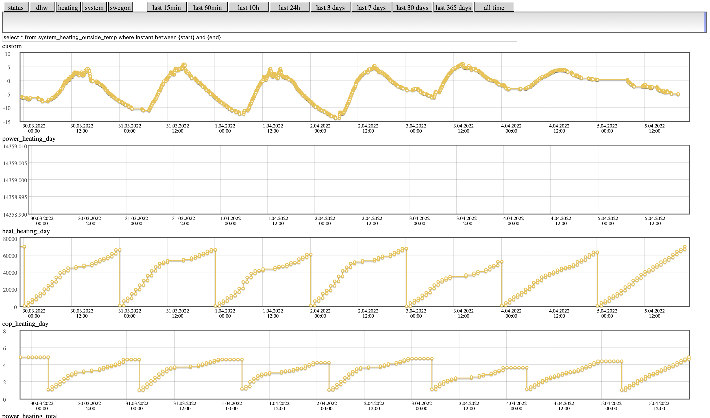

Scripts to read and control some Stiebel-Eltron heat pumps
----------------------------------------------------------

Stiebel doesn't provide an API (or at least I couldn't find one) so the values are parsed from the HTML, and changes are made by submitting forms. Having any kind of API would be much easier but I guess it's not a priority for Stiebel to provide one.

Feel free to use and modify these as you will. Please let me know of any improvements you make for yourself.

Functionality
=============
- collect data for long periods
- store data in SQLite database
- read individual values
- write individual commands
- directly usable with [homebridge](https://homebridge.io)
- HTML page to show graphs with custom querying

Prerequisites
=============
- get a computer (e.g. a virtual server or a Raspberry Pi)
- install Nix (or manually all the things used in scripts)
- install homebridge & plugins
  - `npm install -g --unsafe-perm homebridge`
  - `npm install -g --unsafe-perm homebridge-cmd4`

Setup
=====

Assuming user home directory
```
cd ~
```

Clone this repo
```
git clone https://github.com/jyrimatti/stiebel.git
```

Store Stiebel credentials and hostname
```
echo '<my stiebel user>' > .stiebel-user
echo '<my stiebel password>' > .stiebel-pass
echo '<my stiebel host>' > .stiebel-host
chmod go-rwx .stiebel*
```

Create database
```
./stiebel_createdb.sh
```

[Setup cronjobs](#cron)

[Setup Homebridge](#homebridge-configuration)

~~profit!~~

Dependencies
============

Just install Nix, it handles all the dependencies for you.

However, constantly running nix-shell has a lot of overhead, so you might want to install all the required dependencies globally, and bypass nix-shell when executing scripts from within other processes (cron, cgi, homebridge...):

For example, installing with Nix:
```
> nix-env -f https://github.com/NixOS/nixpkgs/archive/nixos-23.05-small.tar.gz -i sqlite websocat curl jq yq htmlq getoptions bc
```

Then create somewhere a symlink named `nix-shell` pointing to just the regular shell:
```
> mkdir ~/.local/nix-override
> ln -s /bin/sh ~/.local/nix-override/nix-shell
```

after which you can override nix-shell with PATH:
```
PATH=~/.local/nix-override:$PATH ./homebridge/temp.sh
```

Cron
====

Use cron job to read values periodically, for example:
```
2,7,12,17,22,27,32,37,42,47,52,57 * * * * pi export PATH=~/.local/nix-override:$PATH; cd ~/stiebel; ./stiebel_collect2db.sh
```

This will periodically read specified datasets from Stiebel and store them to the databases ignoring consecutive duplicate values.

Read and write
==============

Reading a value from Stiebel (in this case `summermode`):
```
./stiebel_get.sh 4,0,2 | grep 'id="aval103' | sed 's/.*id="aval103"\s*value="\([^"]*\)".*/\1/'
```
The first argument is the page from the URL. You need to grep&sed the correct value from the HTML.

Writing a value to Stiebel (in this case `summermode`):
```
./stiebel_post.sh val103 1
```
The first argument is the key to submit and the second is the value. You need to find the key by doing a submit with the browser.

See the ready made scripts in `./homebridge`

Homebridge configuration
========================

You can use these scripts with Homebridge to show and modify values with Apple HomeKit.

See [example configuration](homebridge/config.json).

HTML page
=========

Build the javascripts by running
```
./installjs.sh
./package.sh
```

If you don't have Nix on some machine, just do it the old fashioned way.

Serve this directory with a web server. You can use `./serve.sh` to try locally. Use Nginx or other web server that supports byte-range-requests and caching for efficient SQLite database access over HTTP.



External hosting
================
If you prefer to serve your graphs from another server, you can configure cronjobs to sync the databases to it. The scripts use vacuum to create an immutable snapshot to sync.

```
0,15,30,45 * * * * myuser export PATH=~/.local/nix-override:$PATH; cd ~/stiebel; ./stiebel_vacuum.sh && rsync -avzq -e "ssh -qo StrictHostKeyChecking=no -o UserKnownHostsFile=/dev/null" ./stiebel.db.bak me@myserver.net:/var/www/stiebel/stiebel.db

```

Standing on the shoulders of
============================
- [curl](https://curl.se)
- [websocat](https://github.com/vi/websocat)
- [getoptions](https://github.com/ko1nksm/getoptions)
- [jq](https://stedolan.github.io/jq/)
- [yq](https://github.com/kislyuk/yq)
- [htmlq](https://github.com/mgdm/htmlq)
- [SQLite](https://www.sqlite.org/index.html)
- [sql.js-httpvfs](https://github.com/phiresky/sql.js-httpvfs)
- [jquery](https://jquery.com)
- [flot](http://www.flotcharts.org)
- [homebridge](https://homebridge.io)
- [cmd4](https://github.com/ztalbot2000/homebridge-cmd4)